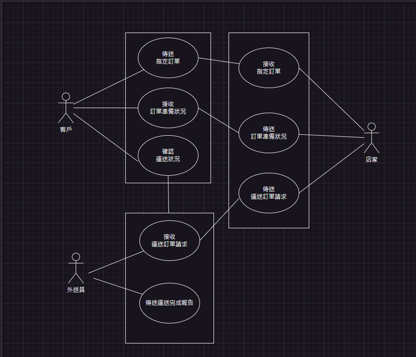
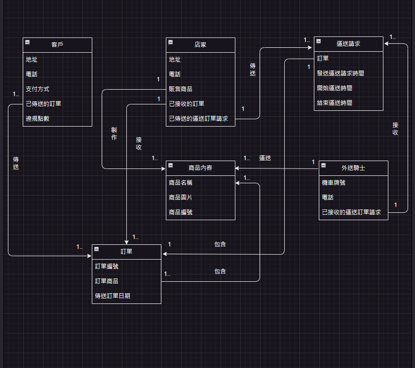

# **外送訂單系統**

## **利害關係人目標表**
|利害關係人|目標|
|---|---|
|客戶|傳送訂單於指定店家 迅速修改傳送於指定店家的訂單 確認商品的準備狀況 確認商品的運送狀況 |
|店家|迅速接收客戶的訂單 準備客戶訂單上所指定的商品 傳送運送訂單請求至店家附近的外送員|
|外送員|根據自身周圍的店家發出的運送請求接收訂單 與店家確認準備的商品是否無誤 將客戶由訂單所指定的商品運送到客戶指定地點 與客戶確認訂單上的商品是否無誤|

## **事件表**
|事件|使用案例|
|-|-|
|傳送訂單於指定商家|訂單傳送作業|
|迅速修改傳送於指定商家的訂單|訂單傳送作業|
|確認商品的準備狀況|商品準備完成通知|
|確認商品的運送狀況|商品運送狀況確認|
|迅速接收客戶的訂單|訂單接收作業|
|準備客戶訂單上所指定的商品|商品準備狀況確認|
|傳送運送訂單請求至店家附近的外送員|訂單商品運送請求傳送作業|
|根據自身周圍的店家發出的運送請求接收訂單|訂單商品運送請求傳送作業|
|與商家確認準備的商品是否無誤|訂單商品點交|
|將客戶由訂單所指定的商品運送到客戶指定地點|商品運送作業|
|與客戶確認訂單上的商品是否無誤|商品確認作業|

## **使用案例表**
### **訂單傳送作業**

|使用案例名稱|訂單傳送作業|
|-|-|
|使用案例描述|客戶於指定店家下訂單後，將訂單傳送於指定店家|
|主要參與者|客戶、店家|
|利害關係人與目標|客戶：傳送指定需要的商品至店家|
|前置條件|無|
|後置條件|無|

|-|參與者|系統|
|-|-|-|
|主要成功情節|1.客戶點選指定店家 2.選擇指定商家所上架的商品，， 3.點選"確認餐點" 4.選擇付費方式以及填寫運送地址和電話，再按"確認送出訂單"|1進入店家所推出的商品菜單 2.選擇的商品被標記，選擇數量+1 3.進入商品確認清單和付費方式和運送地址的確認清單 4.將訂單傳送至指定的店家|

|例外情節|1.如果客人點選商品後反悔取消，則點選"-"鍵減少商品的需求數量，若商品需求數量為0時，取消標記所選擇的商品 2.如果客人沒有選擇商品，按確認訂單，則顯示"尚未選擇餐點" 3.若客人沒有選擇付費方式按"確認送出訂單"，則顯示"尚未選擇付費方式" 4.若客人沒有填寫地址按"確認送出訂單"，則顯示"尚未填寫地址"，若客人沒有填寫電話按"確認送出訂單"，則顯示"尚未填寫電話"，若三種客戶資訊有一種以上未填寫或點選，則顯示"尚未填寫以下選項"，則該文字底下顯示未填寫的項目|
|-|-|
|其他需求|1.商品菜單需顯示商品圖片和描述，描述底下需依序顯示"-"按鈕，訂購數量，"+"按鈕 2.商品種類至少一種，種類清單在螢幕左方，約佔2%大小 3.選項清單所顯示的商品行數及列數依營幕大小決定數量 4.付費方式以清單顯示 5.電話用填寫的方式，電話限10個數字 6.地址可以用填寫的方式，也可以用GPS定位的方式自動填寫地址|

### **訂單接收作業 - T**

|使用案例名稱|訂單接收作業|
|-|-|
|使用案例描述|當客戶傳送訂單至指定店家時，指定店家接收接收訂單並準備指定商品|
|主要參與者|客戶、店家|
|利害關係人與目標|店家：接收客人所傳送的訂單，並確認客人的商品可以準備|
|前置條件|客人的訂單已傳送|
|後置條件|無|

|—|參與者|系統|
|-|-|-|
|主要成功情節|1. -  2.點擊任意介面以停止鈴聲 3.點選接收訂單 4.確認訂單所指定所指定之商品並作準備|1.客戶傳送的訂單傳送至指定店家 2.接收客戶所傳送之訂單，介面顯示"有訂單"之文字，並響起提示鈴聲 3.顯示訂單的詳細資訊和"接收訂單""拒絕接收訂單"按鈕 4.進入訂單商品準備界面|

|例外情節|1.若店家無法準備訂單的指定商品，此情況會在"訂單接收作業 - F"中描述|
|-|-|
|其他需求|無|

### **訂單接收作業 - F**

|使用案例名稱|訂單接收作業|
|-|-|
|使用案例描述|當客戶傳送訂單至指定店家時，指定店家接收接收訂單，但訂單因某些因素而無法準備|
|主要參與者|客戶、店家|
|利害關係人與目標|店家：接收客人所傳送的訂單，但因為訂單無法準備而取消訂單|
|前置條件|客人的訂單已傳送|
|後置條件|無|

|—|參與者|系統|
|-|-|-|
|主要成功情節|1. -  2.點擊任意介面以停止鈴聲 3.點選"無法準備訂單" 4.點選無法準備訂單的原因，並點擊"確認取消"|1.客戶傳送的訂單傳送至指定店家 2.接收客戶所傳送之訂單，介面顯示"有訂單"之文字，並響起提示鈴聲 3.顯示訂單的詳細資訊和"準備訂單""無法準備訂單"按鈕 4.進入"無法準備訂單"界面，並顯示出無法準備訂單原因選項 5.接收"無法準備訂單原因"報告，將報告傳送至客戶，並取消訂單|

|例外情節|1.若店家可以準備訂單的指定商品，此情況則在"訂單接收作業 - T"中描述|
|-|-|
|其他需求|1."無法準備訂單原因"以清單顯示，清單裡包含"缺貨"、"商品過季"、"店家繁忙"、"其他"選項 2.點選其他選項時，選項底下顯示文字輸入框|

### **商品準備狀況確認**

|使用案例名稱|商品準備狀況確認|
|-|-|
|使用案例描述|店家確認可以準備訂單後，並準備商品|
|主要參與者|店家|
|利害關係人與目標|店家：準備客人訂單所指定的商品|
|前置條件|店家點選"準備訂單"，並已進入準備訂單界面|
|後置條件|無|

|—|參與者|系統|
|-|-|-|
|主要成功情節|1.點選指定商品圖示 2準備該商品並點選"已準備"按鈕 3.點選"全部準備完畢"按鈕|1.放大顯示商品圖示，並在圖示底下顯示詳細資訊，右下角顯示"已準備"和"無法準備"按鈕 2.將該商品移至"已準備清單" 2-2.若已全部準備完畢，移至"已準備清單"界面，底下顯示按鈕"全部準備完畢" 3.傳送運送訂單請求至附近外送騎士，並傳送訂單準備完成通知訊息至客戶|

|例外情節|1.若部分商品無法準備，點選無法準備後，移至"無法準備商品原因"並點選無法準備商品原因 2.若部分商品確認無法準備，將"全部準備完畢"按鈕變成"準備完畢"按鈕|
|-|-|
|其他需求|"無法準備商品原因"以清單顯示，清單裡包含"缺貨"、"商品過季"、"其他"選項|

### **商品準備完成通知**

|使用案例名稱|商品準備完成通知|
|-|-|
|使用案例描述|店家將全部或部分商品準備完畢後，將訂單準備完畢通知傳送給客戶|
|主要參與者|店家、客戶|
|利害關係人與目標|店家:傳送訂單準備完畢通知給客戶 客戶:接收訂單準備完畢訊息|
|前置條件|店家準備完成商品並點選"全部準備完畢"按鈕|
|後置條件|無|

|—|參與者|系統|
|-|-|-|
|主要成功情節|1. -  2.接收系統所傳送的簡訊|1.以簡訊的方式傳送，收件人為聯絡人電話 2.傳送簡訊通知: 您已在"指定的店家名稱"所訂的訂單已全部準備完成，準備項目如下: "商品"X"商品數量" "商品"X"商品數量" ... 已盡快派遣外送騎士運送至您所在的地點。|

|例外情節|1.若點選"準備完畢"按鈕，則簡訊內容中的"已全部準備完成"，變成"部分已準備完成" 2.若部分商品無法準備，則簡訊內容準備項目清單下額外增加"無法準備的項目如下:並顯示"無法1準備商品"X"無法準備之數量"，格式如同準備項目|
|-|-|
|其他需求|無|

### **訂單商品運送請求傳送作業**

|使用案例名稱|訂單商品運送請求傳送|
|-|-|
|使用案例描述|店家將全部或部分商品準備完畢後，將傳送運送訂單商品請求給附近的外送騎士|
|主要參與者|店家、外送騎士|
|利害關係人與目標|店家:傳送運送訂單商品請求至店家附近的外送騎士 外送騎士:接收店家運送訂單商品請求|
|前置條件|店家準備完成商品並點選"全部準備完畢"按鈕|
|後置條件|無|

|—|參與者|系統|
|-|-|-|
|主要成功情節|1. -  2.接收到運送請求 3.點擊"確認" 4.移動至店家位置領取訂單商品 5.運送商品至指定地點|1以定位系統追蹤店家周圍方圓1公里內尚未接收運送請求的外送騎士 2.追蹤到尚未接收運送請求的外送騎士後，傳送運送請求給該外送騎士 2-1.在該外送騎士的用戶端顯示店家的地址以及客戶指定運送地址和"確認"按鈕 2-2.將該外送騎士標記為"已接收運送請求" 3.在定位地圖上表示店家位置和客戶指定運送地點的位置，並顯示距離|

|例外情節|1.若在店家周圍方圓內1公里沒追蹤到尚未接收運送請求的外送騎士，就以該店家所在的里來追蹤，若沒有追蹤到，就以該店家所在的區來追蹤 |
|-|-|
|其他需求|1.運送請求優先傳送給尚未標記"已接收運送請求"的外送騎士 2-1.若追蹤到該店家所在的區都沒有尚未標記"已接收運送請求"的外送騎士，則傳送請求至運送請求較少的外送騎士 2-2.續上，若追蹤到外送騎士的運送請求都一樣，則優先給上個運送請求至上個客戶所在的地點離店家較近的外送騎士 3.顯示距離單位為Km，數字顯示為小數點後三位|

### **商品運送狀況確認**

|使用案例名稱|商品運送狀況確認|
|-|-|
|使用案例描述|當外送騎士運送訂單商品時，客戶可以隨時確認商品運送的相關資訊|
|主要參與者|外送騎士、客戶|
|利害關係人與目標|客戶:確認運送訂單商品的相關資訊|
|前置條件|外送騎士接收運送訂單請求，並已開始前往指定店家運送商品|
|後置條件|無|

|—|參與者|系統|
|-|-|-|
|主要成功情節|1. -  2.接收通知 3.點擊通知 |1.追蹤運送指定消費者訂購商品訂單的外送騎士 2.向客戶發送通知:"已找到外送員，正在運送餐點指您所在的住處 3.進入商品運送狀況界面|

|例外情節|無|
|-|-|
|其他需求|1.商品運送狀況界面內容包括外送騎士所在位置，訂單編號、準備好的商品、尚未準備好的商品、預計運送時間、外送騎士和客戶所在位置的距離等 2.外送騎士所在位置以地圖所顯示，以及在地圖標記客戶所在位置 3.外送騎士和客戶所在位置的距離為Km，數字顯示為小數點後三位|

### **商品確認作業**

|使用案例名稱|商品確認作業|
|-|-|
|使用案例描述|當外送騎士將訂單的商品送至客戶所在位置，將商品給客戶並確認訂單的商品以送達|
|主要參與者|外送騎士、客戶|
|利害關係人與目標|外送騎士:運送到客戶所在位置後，將商品給客戶並確認訂單賞品已運送完成 客戶:接收外送騎士所運送的訂單商品|
|前置條件|外送騎士將訂單的商品送至客戶所在位置|
|後置條件|無|

|—|參與者|系統|
|-|-|-|
|主要成功情節|1-3.點及界面任意位置以取消通知 2.將商品傳送至客戶 3.拍攝"將商品給客戶"的照片 4.上傳"將商品給客戶"的照片 5.點擊"商品已確認運送完畢"，繳交訂單商品運送完成的報告|1-1.定位追蹤到外送騎士已將商品送達至客戶所在位置 1-2.傳送通知:"商品已送達"至客戶 1-3.提示外送騎士:"已到達客戶所在地址，請將商品運送至客戶" 1-4.移至"繳交訂單商品運送完成"介面 2. -  3. -  4.接收"將商品給客戶"的照片 5.傳送訂單商品運送完成的報告|

|例外情節|若無法將商品傳送至客戶，點擊"無法將商品傳送至客戶"按鈕並移至"無法將商品傳送至客戶的報告"介面並填寫原因，傳送完報告後，該訂單作廢，店家的損失由廠商補貼，發出商品訂單的客戶記違規1點。若到2點，則取消該客戶的外送訂單服務。|
|-|-|
|其他需求|1."繳交訂單商品運送完成"介面所顯示內容有訂單編號、運送日期、運送商品內容("商品名稱"X"商品數量")、開始運送時間、送達時間、可讓使用者(外送騎士)上傳"將商品給客戶"的照片、以及"商品已確認運送完畢"按鈕和"無法將商品傳送至客戶"按鈕 2.若運送訂單已運達或取消，該外送騎士沒有其他運送訂單請求，則消除"已接收運送請求"的標記。|

## **使用案例圖**

## **初步類別圖**

## **系統循序圖**

<>

## **心得**

